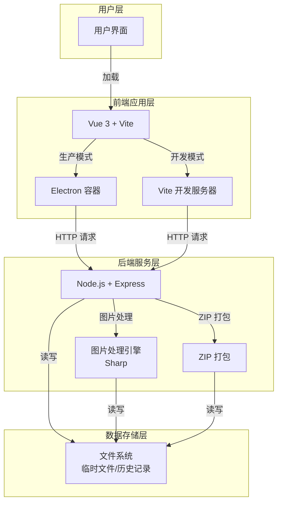
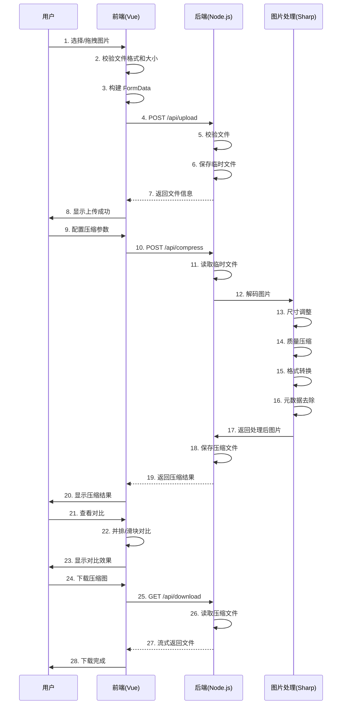
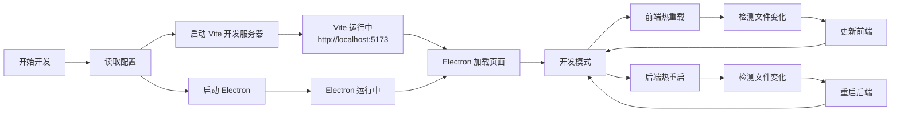
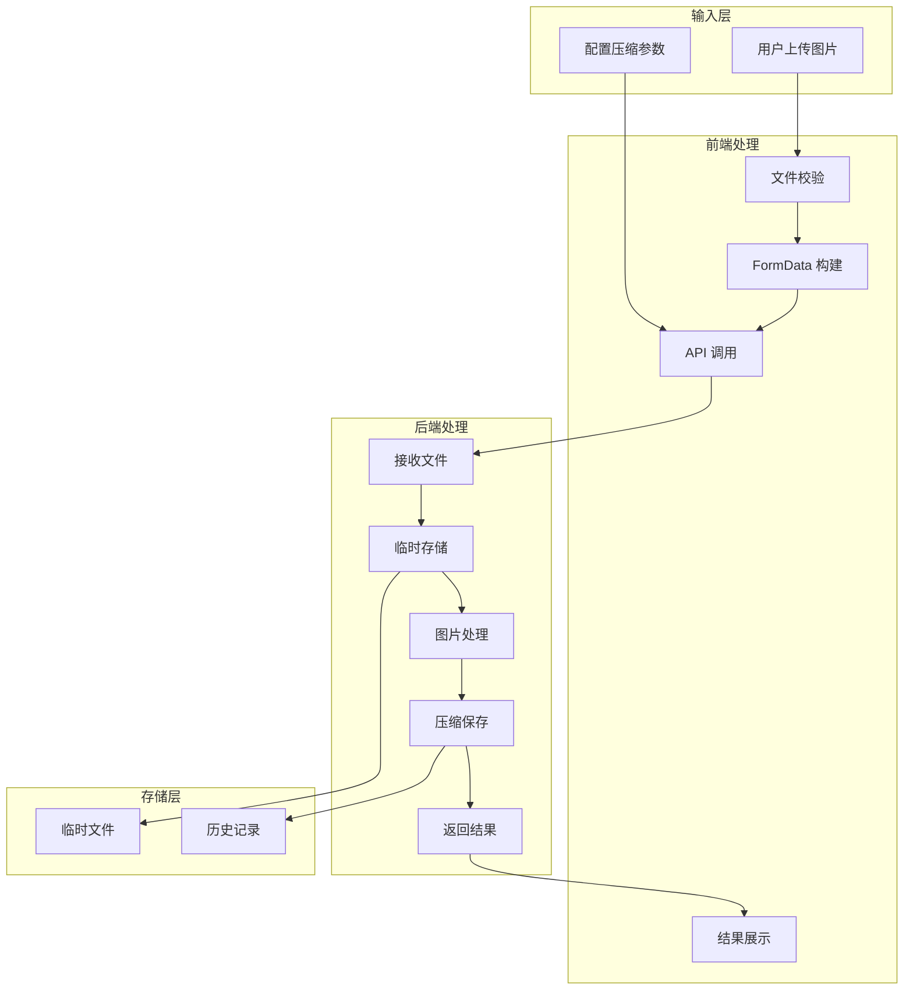
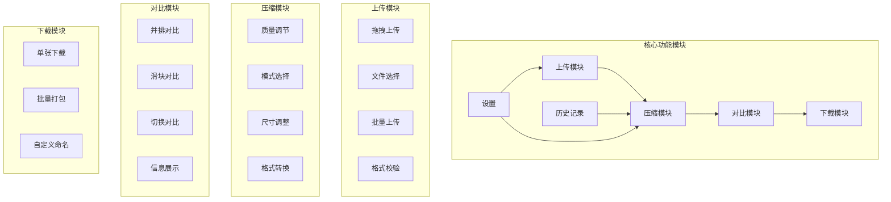
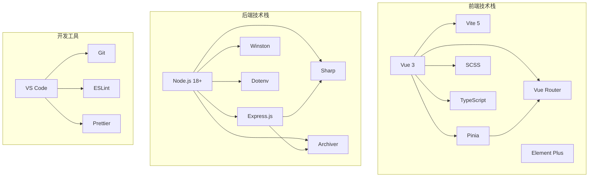
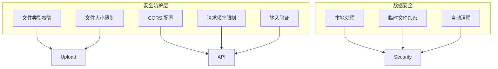
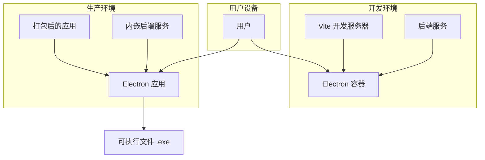

# 图片压缩工具 - 技术架构图

## 1. 整体架构流程图



## 2. 前后端交互流程图



## 3. 开发环境启动流程图



## 4. 目录结构树形图

```
pictrue-compress/
│
├── docs/                          # 文档目录
│   ├── 需求分析.md
│   ├── 技术方案.md
│   └── 技术架构图.md
│
├── frontend/                      # 前端项目
│   ├── src/
│   │   ├── assets/               # 静态资源
│   │   │   ├── images/
│   │   │   └── styles/
│   │   ├── components/           # 公共组件
│   │   │   ├── Upload/
│   │   │   ├── Compression/
│   │   │   ├── Comparison/
│   │   │   └── common/
│   │   ├── views/                # 页面组件
│   │   │   ├── Home.vue
│   │   │   ├── History.vue
│   │   │   └── Settings.vue
│   │   ├── router/               # 路由配置
│   │   │   └── index.ts
│   │   ├── store/                # 状态管理
│   │   │   ├── modules/
│   │   │   │   ├── upload.ts
│   │   │   │   ├── compression.ts
│   │   │   │   └── history.ts
│   │   │   └── index.ts
│   │   ├── api/                  # API 接口
│   │   │   ├── upload.ts
│   │   │   ├── compression.ts
│   │   │   ├── history.ts
│   │   │   └── index.ts
│   │   ├── utils/                # 工具函数
│   │   │   ├── request.ts
│   │   │   ├── image.ts
│   │   │   └── file.ts
│   │   ├── types/                # TypeScript 类型定义
│   │   │   ├── index.ts
│   │   │   ├── upload.ts
│   │   │   ├── compression.ts
│   │   │   └── history.ts
│   │   ├── App.vue
│   │   └── main.ts
│   ├── public/                   # 公共文件
│   ├── tests/                    # 测试文件
│   ├── index.html
│   ├── vite.config.ts
│   ├── tsconfig.json
│   └── package.json
│
├── backend/                      # 后端项目
│   ├── src/
│   │   ├── config/               # 配置文件
│   │   │   ├── app.ts
│   │   │   ├── upload.ts
│   │   │   └── compression.ts
│   │   ├── controllers/          # 控制器
│   │   │   ├── upload.controller.ts
│   │   │   ├── compression.controller.ts
│   │   │   ├── history.controller.ts
│   │   │   └── settings.controller.ts
│   │   ├── services/             # 业务逻辑
│   │   │   ├── upload.service.ts
│   │   │   ├── compression.service.ts
│   │   │   ├── history.service.ts
│   │   │   └── settings.service.ts
│   │   ├── routes/               # 路由
│   │   │   ├── upload.route.ts
│   │   │   ├── compression.route.ts
│   │   │   ├── history.route.ts
│   │   │   ├── settings.route.ts
│   │   │   └── index.ts
│   │   ├── middleware/           # 中间件
│   │   │   ├── upload.ts
│   │   │   └── error.ts
│   │   ├── utils/                # 工具函数
│   │   │   ├── file.ts
│   │   │   ├── logger.ts
│   │   │   └── validator.ts
│   │   ├── models/               # 数据模型
│   │   │   └── history.ts
│   │   ├── app.ts                # 应用入口
│   │   └── server.ts             # 服务器启动
│   ├── uploads/                  # 临时上传文件目录
│   ├── logs/                     # 日志文件
│   ├── tests/                    # 测试文件
│   ├── .env.example
│   ├── tsconfig.json
│   └── package.json
│
├── scripts/                      # 构建脚本
│   ├── build-frontend.sh
│   ├── build-backend.sh
│   └── package-app.sh
│
├── package.json                  # 根配置文件
└── README.md
```

## 5. 数据流图



## 6. 核心功能模块图



## 7. 技术栈关系图



## 8. API 接口关系图

```mermaid
graph TB
    subgraph "API 接口层"
        UploadAPI[上传接口]
        CompressAPI[压缩接口]
        DownloadAPI[下载接口]
        HistoryAPI[历史接口]
        SettingsAPI[设置接口]
    end

    subgraph "上传接口"
        U1[POST /api/upload]
        U2[POST /api/upload/batch]
    end

    subgraph "压缩接口"
        C1[POST /api/compress]
        C2[POST /api/compress/batch]
        C3[GET /api/compress/status/:id]
    end

    subgraph "下载接口"
        D1[GET /api/download/:id]
        D2[GET /api/download/batch]
    end

    subgraph "历史接口"
        H1[GET /api/history]
        H2[DELETE /api/history/:id]
        H3[DELETE /api/history]
        H4[GET /api/history/export]
    end

    subgraph "设置接口"
        S1[GET /api/settings]
        S2[POST /api/settings]
    end

    UploadAPI --> U1
    UploadAPI --> U2
    CompressAPI --> C1
    CompressAPI --> C2
    CompressAPI --> C3
    DownloadAPI --> D1
    DownloadAPI --> D2
    HistoryAPI --> H1
    HistoryAPI --> H2
    HistoryAPI --> H3
    HistoryAPI --> H4
    SettingsAPI --> S1
    SettingsAPI --> S2
```



## 9. 安全性架构图



## 10. 部署架构图


